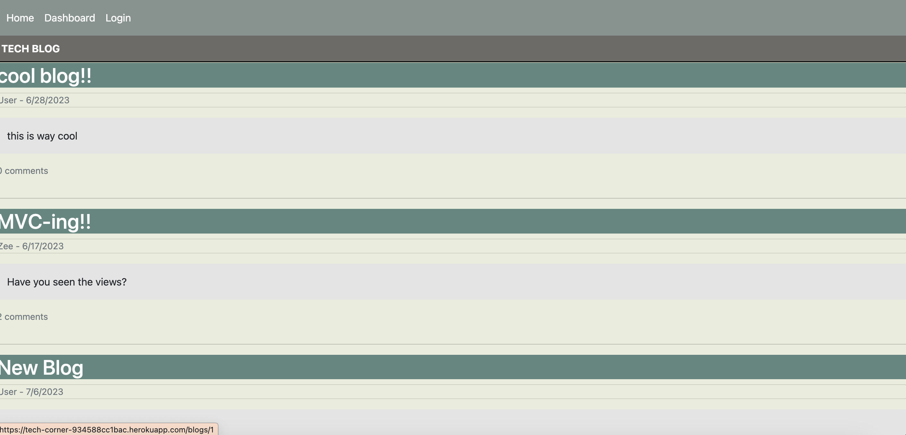

# Tech Blog

    
## Table of Contents
- [Description](#Description)
- [Screenshot](#Screenshot)
- [Usage](#Usage)
- [Installation](#Installation)
- [Questions](#Questions)
- [Deployed] (#Deployed Link)
- [License](#License)

## Description
Tech Blog is a fullstack application that utlizes a SQL database and Handlebars front end. The client sees a blog site that they can login into or sign up for and start reading and commenting on other's blogs and create their own.

## Screenshot

## Usage
Free use

## Installation
Through github and run through node. Alternatively you can navigate to the deployed appl

## Questions
Come say hi and ask any questions on www.github.com/zeeDabbagh

## Deployed link
[TechBlog](https://tech-corner-934588cc1bac.herokuapp.com/login)

## License
Licensed under the [MIT](https://choosealicense.com/licenses/mit/) license.